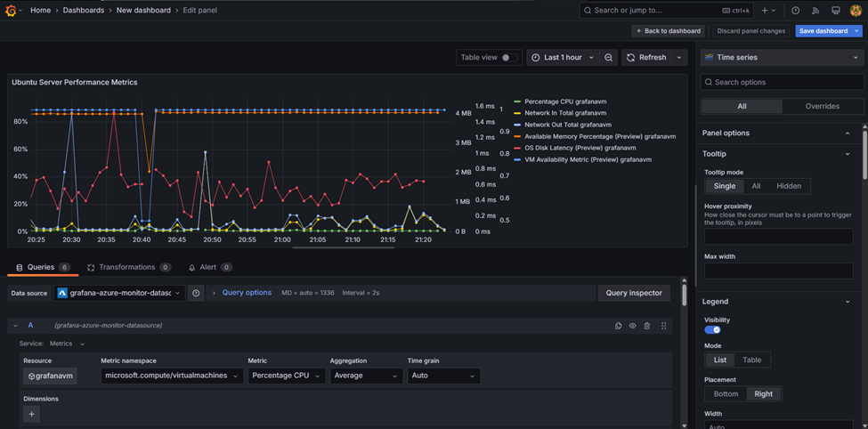

# **CST8919 – Lab 3: Grafana Installation and Dashboard Creation**
**Student:** James Ngugi - 041079312  
**Lab Title:** Grafana Installation and Dashboard for Ubuntu Server Performance  
**Course:** DevOps – Security and Compliance (CST8919)  

## **Screenshot Descriptions**

---

### **Step 1**

**Description:**  
Configured and deployed Ubuntu Server VM to run Grafana.

---

### **Step 2**

**Description:**  
Logging into the Ubuntu VM using SSH

---

### **Step 3**

**Description:**  
Installing Grafana on the Ubuntu VM.

---

### **Step 4**

**Description:**  
Starting Grafana service on the Ubuntu VM.

---

### **Step 5**

**Description:**  
Configuring Security Group to allow inbound traffic on port 3000 for Grafana

---

### **Step 6**

**Description:**  
Browsing to the Grafana Log In page.

---

### **Step 7**

**Description:**  
Configuring the managed identity on the Grafana VM

---

### **Step 8**

**Description:**  
Enabling managed identity authentication on Grafana.

---

### **Step 9**

**Description:**  
Restarting Grafana for the changes to take effect.

---

### **Step 10**

**Description:**  
Configuring Azure Monitor on Grafana
---

### **Step 11**

**Description:**  
Configuring the Dashboard and Panel to show metrics.

---

### **Step 12**

**Description:**  
Showing a different view of the panel

---

### **Step 13**

**Description:**  
Adding thresholds.

---

